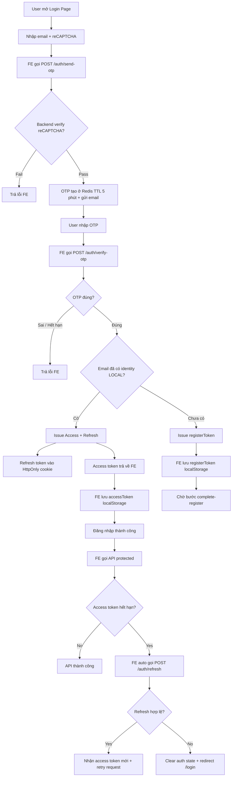
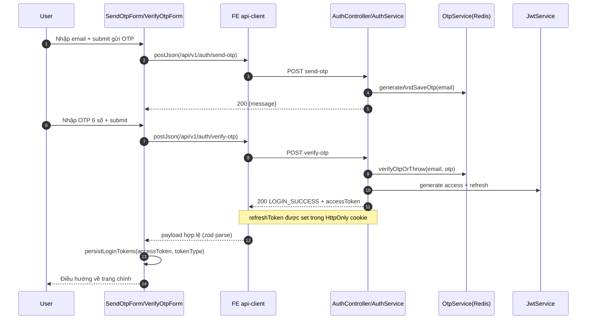
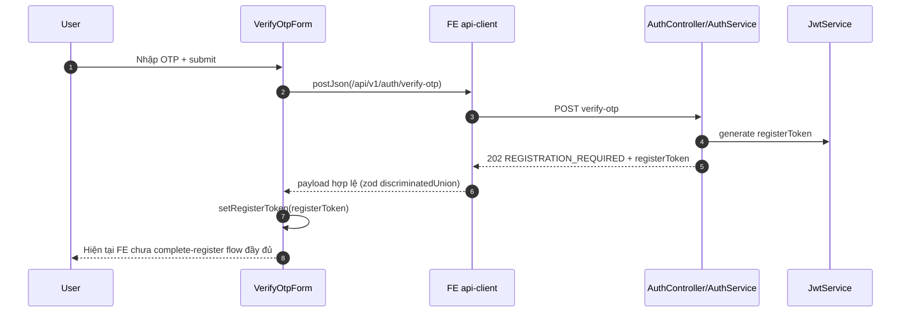
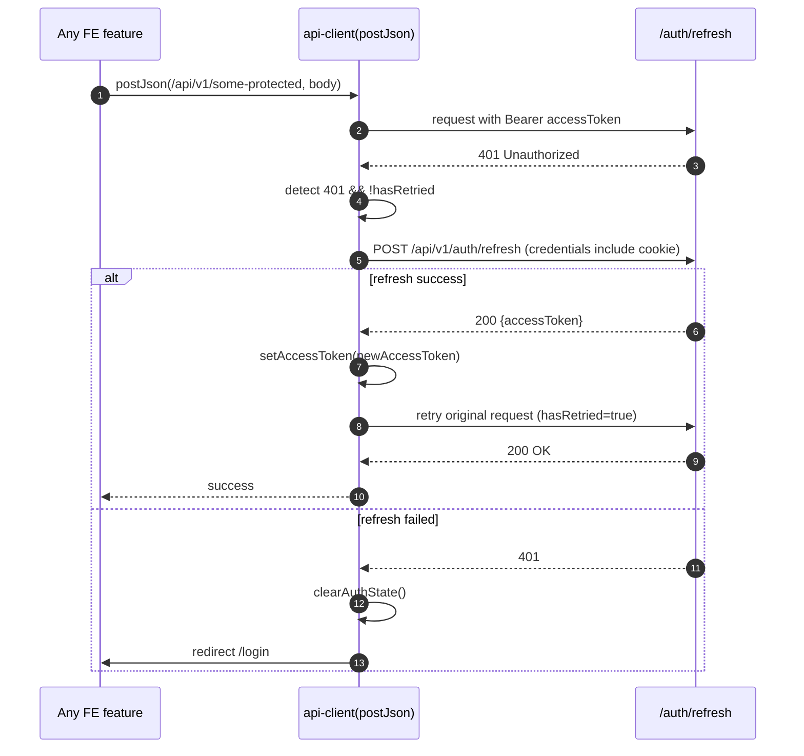

# OTP Login/Register Flow – Deep Review (Mermaid v11.13.0)

> **Status update (frontend):**
> Route `/register` và luồng `POST /api/v1/auth/complete-register` đã được triển khai.
> Nhánh `REGISTRATION_REQUIRED` hiện sẽ điều hướng sang `/register` để hoàn tất đăng ký.

## 1) Mục tiêu tài liệu

Tài liệu này giải thích **toàn bộ luồng đăng nhập và đăng ký bằng OTP** theo kiểu “từ cơ bản đến nâng cao”.

Bạn sẽ thấy rõ:

- Flowchart tổng quan.
- Sequence flow chi tiết.
- File nào làm nhiệm vụ gì.
- Kiến thức/syntax cốt lõi đang dùng.
- Vấn đề thực tế (problem) và cách xử lý (solution).

---

## 2) Phạm vi deep-review

### Frontend (event-manager-fe)

- `send OTP` + `verify OTP` đã có.
- `register complete` **chưa có UI flow hoàn chỉnh** (hiện mới lưu `registerToken` vào `localStorage`).
- Có auto refresh access token ở API client cho request protected.

### Backend (eventmanager)

- Đã có đầy đủ endpoint passwordless:
  - `POST /api/v1/auth/send-otp`
  - `POST /api/v1/auth/verify-otp`
  - `POST /api/v1/auth/complete-register`
  - `POST /api/v1/auth/refresh`
  - `POST /api/v1/auth/logout`

---

## 3) Cấu trúc file và trách nhiệm

## 3.1 Frontend files

| File                                             | Vai trò                                                                                |
| ------------------------------------------------ | -------------------------------------------------------------------------------------- |
| `src/features/auth/components/SendOtpForm.tsx`   | Form nhập email + reCAPTCHA, gọi mutation gửi OTP, chuyển route sang verify-otp        |
| `src/features/auth/components/VerifyOtpForm.tsx` | Form nhập OTP, gọi verify OTP, tách nhánh `LOGIN_SUCCESS` hoặc `REGISTRATION_REQUIRED` |
| `src/features/auth/api/send-otp.ts`              | Validate request/response bằng Zod, gọi API `/send-otp`                                |
| `src/features/auth/api/verify-otp.ts`            | Validate request/response bằng Zod, gọi API `/verify-otp`                              |
| `src/features/auth/api/refresh.ts`               | Gọi API `/refresh`                                                                     |
| `src/features/auth/api/schemas.ts`               | Nơi định nghĩa schema Zod và type inference                                            |
| `src/features/auth/hooks/useSendOtp.ts`          | React Query mutation cho send-otp                                                      |
| `src/features/auth/hooks/useVerifyOtp.ts`        | React Query mutation cho verify-otp                                                    |
| `src/lib/api-client.ts`                          | HTTP POST JSON + attach access token + retry sau refresh khi bị 401                    |
| `src/lib/auth-storage.ts`                        | Quản lý key/token trong localStorage                                                   |
| `src/lib/api-response.ts`                        | Parse payload + map lỗi từ payload                                                     |
| `src/routes/login.tsx`                           | Route `/login`                                                                         |
| `src/routes/verify-otp.tsx`                      | Route `/verify-otp`, validate query `email`, guard redirect nếu thiếu                  |

## 3.2 Backend files (liên quan auth)

| File                                           | Vai trò                                                       |
| ---------------------------------------------- | ------------------------------------------------------------- |
| `domain/auth/controller/AuthController.java`   | Expose endpoint auth, set/clear refresh cookie                |
| `domain/auth/service/AuthService.java`         | Điều phối logic nghiệp vụ OTP + token + register              |
| `domain/auth/service/OtpService.java`          | Sinh OTP, lưu Redis TTL, đếm fail, lock tạm thời              |
| `domain/auth/service/JwtService.java`          | Sinh/parse `ACCESS`, `REFRESH`, `REGISTER` token              |
| `domain/auth/service/RefreshTokenService.java` | Quản lý token family (`familyId`, `jti`) để chống token theft |
| `core/security/CookieUtils.java`               | Set refresh token cookie `HttpOnly + SameSite`                |
| `domain/auth/service/RecaptchaService.java`    | Verify reCAPTCHA với Google                                   |

---

## 4) Flowchart tổng quan (E2E)

---

## 5) Sequence flow chi tiết

## 5.1 Sequence A – Login thành công (existing user)

## 5.2 Sequence B – OTP đúng nhưng là user mới (register required)

## 5.3 Sequence C – Refresh token và retry protected request

---

## 6) Giải thích

Hãy tưởng tượng:

- **Email** là địa chỉ nhà của bạn.
- **OTP** là mã bí mật chỉ dùng 1 lần, giống “mật khẩu giấy” gửi qua thư.
- **Access token** là vé vào cổng có thời hạn ngắn.
- **Refresh token** là thẻ gia hạn vé, nhưng được cất trong túi bí mật (cookie HttpOnly) để đỡ bị đọc trộm.

Quy trình đơn giản:

1. Bạn nói: “Con là ai” bằng email.
2. Hệ thống gửi một mã OTP về email.
3. Bạn nhập mã OTP.
4. Nếu đúng:
   - Nếu đã có tài khoản: cho vào luôn.
   - Nếu chưa có: phát “phiếu đăng ký” (`registerToken`) để điền thông tin tiếp.

---

## 7) Kiến thức và syntax cốt lõi trong flow

## 7.1 React + TypeScript

- `useState` giữ state local (`email`, `otp`, `formError`).
- Form submit với `React.FormEvent<HTMLFormElement>`.
- `onChange` để cập nhật input theo thời gian thực.

## 7.2 TanStack Query (mutation)

- `useMutation` dùng cho thao tác ghi (POST).
- `mutate(payload, { onSuccess })` để xử lý sau khi API thành công.

## 7.3 Zod runtime validation

- `schema.parse(data)` để kiểm tra input/output đúng shape.
- `z.discriminatedUnion('status', [...])` để tách nhánh response theo trường `status`:
  - `LOGIN_SUCCESS`
  - `REGISTRATION_REQUIRED`

## 7.4 Token model

- `ACCESS` token: sống ngắn, gửi trong `Authorization: Bearer ...`.
- `REFRESH` token: sống dài hơn, nằm ở cookie HttpOnly.
- `REGISTER` token: tạm thời cho luồng đăng ký user mới.

## 7.5 Redis OTP pattern

- Key OTP và key đếm sai có TTL 5 phút.
- Sai quá số lần cho phép => khóa tạm thời (`429`).

## 7.6 Auto refresh pattern

- Khi request protected bị `401`, FE thử gọi `/refresh`.
- Nếu refresh thành công, FE retry request cũ đúng 1 lần.
- Nếu thất bại, xóa auth state và quay về `/login`.

---

## 8) Core bản chất vấn đề

Bản chất của passwordless OTP auth là:

1. **Không dùng mật khẩu cố định**
   - Giảm rủi ro người dùng đặt mật khẩu yếu.

2. **Dựa vào quyền sở hữu email**
   - Ai nhận được OTP mới xác minh được.

3. **Tách token theo mục đích**
   - Mỗi token có “purpose” rõ ràng (`ACCESS`, `REFRESH`, `REGISTER`), tránh dùng sai mục đích.

4. **Giảm tác hại khi token hết hạn hoặc bị lộ**
   - Access token ngắn hạn.
   - Refresh có cơ chế rotation/family ở backend.

---

## 9) Problem vs Solution (ví dụ thực tế)

## 9.1 Problem: User nhập sai OTP nhiều lần

- **Triệu chứng:** Bot thử OTP liên tục.
- **Solution:** Redis fail counter + lock tạm (`429`) trong `OtpService`.

## 9.2 Problem: Access token hết hạn giữa lúc đang thao tác

- **Triệu chứng:** API protected trả `401`, UX bị đứt.
- **Solution:** `api-client` tự refresh và retry 1 lần.

## 9.3 Problem: Dữ liệu response backend không đúng contract

- **Triệu chứng:** UI crash hoặc hiển thị sai.
- **Solution:** Parse response bằng Zod trước khi dùng.

## 9.4 Problem: User mới verify OTP xong nhưng chưa có profile

- **Triệu chứng:** Không thể login “full” ngay.
- **Solution:** Trả `REGISTRATION_REQUIRED + registerToken`, sau đó gọi `/complete-register`.

## 9.5 Problem (hiện tại FE): Chưa hoàn tất register UI flow

- **Triệu chứng:** FE đã lưu `registerToken` nhưng chưa có màn hình/route `complete-register`.
- **Solution đề xuất:**
  1. Tạo route `/register`.
  2. Tạo form `firstName`, `lastName`, `identityNumber`, `identityType`.
  3. Gọi `POST /api/v1/auth/complete-register`.
  4. Lưu access token + điều hướng về trang chính.

---

## 10) Mermaid syntax đã áp dụng (v11.13.0)

Tài liệu này dùng các cú pháp Mermaid chuẩn:

- `flowchart TD` cho luồng quyết định tổng quát.
- `sequenceDiagram` + `participant` + `autonumber` cho trình tự message.
- `alt ... else ... end` để mô tả rẽ nhánh logic.
- `Note over A,B` để ghi chú nghiệp vụ/cơ chế.

Các syntax trên tương thích Mermaid v11.13.0 và phù hợp cho docs kỹ thuật.

---

## 11) Tóm tắt ngắn

- Luồng OTP login hiện tại đã hoạt động tốt ở phần send/verify/refresh.
- Backend đã sẵn sàng cho complete register.
- Frontend còn thiếu mảnh ghép cuối: **UI complete-register** và điều hướng sau `REGISTRATION_REQUIRED`.

Khi bổ sung mảnh này, flow login/register OTP sẽ khép kín end-to-end.
